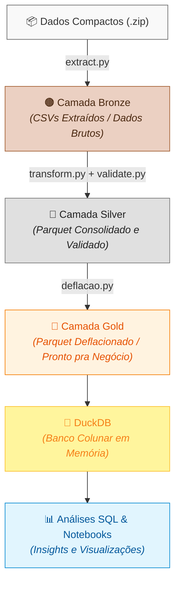

# 📊 Análise Comparativa de Despesas por Função nas Capitais Brasileiras

🎓 **Desafio de Estágio em Análise de Dados** | Sefaz Maceió (2026)

 
 


## 📑 Índice

- [Problema e Contexto](#-problema-e-contexto)
- [Arquitetura da Solução](#%EF%B8%8F-arquitetura-da-solução)
- [Estrutura de Pastas](#-estrutura-de-pastas)
- [Decisões Técnicas](#-decisões-técnicas)
- [Como Executar](#-como-executar)
- [Deflação de Dados](#-deflação-de-dados)
- [Análises Disponíveis](#-análises-disponíveis)
- [Testes](#-testes)
- [Licença](#-licença)


## 🎯 Problema e Contexto

Este projeto é uma solução desenvolvida para o **Desafio Técnico de Estágio em Análise de Dados** da [Sefaz Maceió](descricao_desafio.md).

O desafio consiste em analisar dados de **despesas das 26 capitais brasileiras** no período de **2020 a 2025**, publicados pelo **Siconfi** (Sistema de Informações Contábeis e Fiscais do Setor Público Brasileiro / Tesouro Nacional). 

O objetivo principal é **comparar como as capitais alocam e gastam os recursos públicos por área (função)**, investigando especialmente as discrepâncias entre o **empenhado** (comprometido em orçamento) e o **pago** (efetivamente desembolsado).

> 📌 Para detalhes completos sobre as especificações, regras de negócio e motivação, consulte o arquivo [descricao_desafio.md](descricao_desafio.md).


## 🏗️ Arquitetura da Solução

A solução adota o **Padrão Medallion** de arquitetura de dados, organizando o pipeline em camadas progressivas de qualidade, enriquecimento e consumo:



### 🔄 Fluxo de Processamento

| Estágio | Script(s) | Entrada | Saída / Formato | Descrição |
| --- | --- | --- | --- | --- |
| **Ingestão** | `extract.py` | Arquivo `.zip` | **Bronze** (`.csv`) | Descompactação e carga bruta dos arquivos originais sem alteração. |
| **Silver** | `transform.py` + `validate.py` | Camada Bronze | **Silver** (`.parquet`) | Limpeza, padronização, consolidação e validação de qualidade (Pandera). |
| **Gold** | `deflacao.py` | Camada Silver | **Gold** (`.parquet`) | Ajuste inflacionário via IPCA e modelagem final para consumo analítico. |
| **Carga** | N/A | Camada Gold | **DuckDB** | Ingestão e indexação dos arquivos Parquet no banco colunar em memória. |
| **Consumo** | N/A | DuckDB | **SQL & Notebooks** | Consultas de alta performance, geração de métricas e visualizações. |

## 📁 Estrutura de Pastas

```text
.
├── README.md                          # Documentação principal do projeto
├── pyproject.toml                     # Dependências e metadados do projeto
├── database.duckdb                    # Banco DuckDB (gerado após execução do pipeline)
├── dados_compactos/                   # Camada Raw: arquivos ZIP originais organizados por ano
├── dados_extraidos/                   # Camada Bronze: CSVs descompactados
├── dados_processados/                 # Camadas Silver & Gold:
│   ├── finbra.parquet                 # Consolidação dos CSVs (Silver)
│   └── finbra_deflacionado.parquet    # Dados com ajuste inflacionário (Gold)
├── notebooks/                         # Análises exploratórias e descritivas
│   ├── analise_exploratoria.ipynb
│   └── analise_descritiva.ipynb
├── src/
│   ├── main.py                        # Ponto de entrada / Orquestrador geral do projeto
│   ├── pipeline.py                    # Pipeline principal ETL
│   ├── query_exploratoria.py          # Queries SQL para exploração inicial
│   ├── query_descritiva.py            # Queries SQL para análise descritiva
│   ├── config/                        # Módulos de configuração centralizada
│   │   ├── ConexaoBanco.py            # Conexão e gerenciamento do DuckDB
│   │   ├── DataFrameConfig.py         # Schemas Pandera e regras de qualidade
│   │   ├── Paths.py                   # Gerenciamento dinâmico de caminhos
│   │   ├── logs.py                    # Configuração centralizada de logging
│   │   └── grafico.py                 # Utilities e temas para gráficos
│   ├── scripts/                       # Etapas do pipeline (ETL)
│   │   ├── extract.py                 # Extração dos ZIPs
│   │   ├── transform.py               # Tratamento, limpeza e exportação Parquet
│   │   └── validate.py                # Validação de dados com Pandera
│   ├── deflacao/                      # Módulo de correção monetária
│   │   ├── deflacao.py                # Lógica de ajuste (pandas/DuckDB)
│   │   └── ipca_utils.py              # Integração com API SIDRA (IBGE)
│   └── visualizacao/                  # Funções para plots e gráficos
│       ├── bar_ranking_pagamento_divida.py
│       ├── frequencia.py
│       ├── linha_comparativo_cultura_per_capita.py
│       ├── linha_comparativo_taxa_execucao.py
│       ├── linha_deflacao.py
│       └── linha_evolucao_subfuncoes_cultura.py
└── tests/                             # Suíte de testes unitários
    ├── test_extract.py
    ├── test_transform.py
    ├── test_validate.py
    └── test_pipeline.py

```

### 🔧 Responsabilidade dos Scripts Principais

| Script | Responsabilidade |
| --- | --- |
| **`pipeline.py`** | Executa a sequência ETL (`extract` → `transform` → `validate` → `deflacao`), controlando exceções e logs. |
| **`extract.py`** | Varre a pasta `dados_compactos/` e extrai os arquivos ZIP para a camada Bronze. |
| **`transform.py`** | Aplica tratamento de encodings, conversão de tipos de dados, sanitização e unificação em arquivo Parquet. |
| **`validate.py`** | Valida os schemas com **Pandera**, aplicando regras de integridade física e de negócio. |
| **`deflacao.py`** | Consulta o IPCA via API SIDRA/IBGE e calcula a correção monetária dos valores históricos. |


## 💡 Decisões Técnicas

### 1️⃣ Arquitetura Medallion (Bronze → Silver → Gold)

A separação em camadas garante:

* **Rastreabilidade e Auditabilidade**: Os dados brutos permanecem intactos na camada Bronze.
* **Isolamento de Responsabilidade**: Erros na transformação não corrompem a ingestão original.
* **Flexibilidade**: Novas regras de negócio podem ser reprocessadas a partir da camada Silver sem necessidade de re-extração.

### 2️⃣ Formato Parquet para Armazenamento

Em substituição ao CSV tradicional na Silver/Gold, o uso do **Parquet** oferece:

* **Compressão Superior**: Redução de ~80-90% no tamanho em disco.
* **Leitura Colunar**: Consultas SQL significativamente mais rápidas ao ler apenas as colunas necessárias.
* **Preservação de Schemas**: Evita perda de tipos de dados (datas, numéricos) entre execuções.

### 3️⃣ Validação com Pandera

Antes da carga final, os dados passam por testes de contrato com Pandera:

* Tipagem forte de colunas.
* Verificação de regras de negócio (ex: $Despesa\ Paga \le Despesa\ Empenhada$).
* Tratamento preventivo de valores nulos e *outliers* inconsistentes.

### 4️⃣ DuckDB como Motor de Consultas

A escolha do **DuckDB** traz as seguintes vantagens:

* **Embedded/Zero Overhead**: Não exige instalação de servidores de banco de dados pesados.
* **Otimização OLAP**: Processamento colunar ideal para agregações analíticas complexas.
* **Integração Direta com Parquet**: Permite executar SQL diretamente sobre os arquivos em disco ou memória.


## 🚀 Como Executar

### 📋 Pré-requisitos

* **Python**: Versão 3.10 ou superior
* **Git**

### Passo 1: Clonar o Repositório

```bash
git clone git@github.com:doardoE/Desafio-Analista-de-Dados-Sefaz-Macei-.git
cd Desafio-Analista-de-Dados-Sefaz-Macei-.git

```

### Passo 2: Criar e Ativar o Ambiente Virtual

```bash
# Criar ambiente virtual
python -m venv .venv

# Ativar no Windows (PowerShell):
.venv\Scripts\activate

# Ativar no Linux / macOS:
source .venv/bin/activate
```

### Passo 3: Instalar Dependências

```bash
pip install -e .
```

> 📦 *O comando acima instala o projeto no modo editável juntamente com as dependências especificadas no `pyproject.toml` (pandas, polars, duckdb, pandera, plotly, pytest, etc).*

### Passo 4: Executar o Pipeline Completo

```bash
python -m src.main
```

**O orquestrador executará sequencialmente:**

1. 📦 Extração dos ZIPs em `dados_compactos/` $\rightarrow$ `dados_extraidos/`
2. 🔀 Consolidação e limpeza $\rightarrow$ `dados_processados/finbra.parquet`
3. ✔️ Validação de integridade via Pandera
4. 📈 Cálculo de deflação (IPCA) $\rightarrow$ `dados_processados/finbra_deflacionado.parquet`
5. 💾 Criação e população do banco analítico `database.duckdb`


## 📊 Deflação de Dados

### Motivação

⚠️ Comparar valores ao longo de múltiplos anos sem ajuste inflacionário leva a conclusões enganosas. Um gasto de R$ 1 milhão em 2020 tinha poder de compra diferente em 2025.

### Implementação

O módulo `src/deflacao/` implementa deflação usando:

- **API SIDRA** 📡: consulta pública do IBGE para séries do IPCA (Índice de Preços ao Consumidor Amplo)
- **ipca_utils.py** 📥: funções para baixar índices acumulados por período
- **deflacao.py** 🔄: implementações de deflação em **pandas** e **DuckDB**

#### Por que Pandas e DuckDB?

- **Pandas**: a resposta da API vem como JSON → DataFrame. Usamos pandas para processar esses dados brutos.
- **DuckDB**: uma vez processados, usamos SQL via DuckDB para deflacionar o Parquet consolidado de forma eficiente.

#### Por que um Novo Parquet em vez de Substituir?

Mantemos **dois arquivos Parquet separados**:

| Arquivo | Conteúdo |
|---------|----------|
| `finbra.parquet` | Valores nominais originais (sem deflação) |
| `finbra_deflacionado.parquet` | Valores em moeda constante (ex.: 2025) |

**Razões para esta abordagem:**

1. 🔍 **Auditoria**: é possível rastrear dados originais vs. transformados
2. 🎯 **Flexibilidade**: diferentes análises podem precisar de valores nominais ou reais
3. 🔄 **Reprodutibilidade**: mudanças futuras na metodologia não perdem histórico
4. 🛡️ **Boas práticas**: não mutamos dados raw (imutabilidade de dados)


## 📈 Análises Disponíveis

Os resultados e visualizações encontram-se estruturados nos Jupyter Notebooks na pasta `notebooks/`:

### 🔍 [analise_exploratoria.ipynb](/notebooks/analise_exploratoria.ipynb)

* Verificação de dimensões, cardinalidade e cobertura temporal do dataset.
* Mapeamento da completude dos dados por município.
* Distribuição geral das despesas por função orçamentária.

### 📊 [analise_descritiva.ipynb](/notebooks/analise_descritiva.ipynb)

* **Taxa de Execução Financeira**: Avaliação do percentual efetivamente pago frente ao empenhado:

$$\text{Taxa de Execução (\%)} = \left(\frac{\text{Despesas Pagas}}{\text{Despesas Empenhadas}}\right) \times 100$$


* **Restos a Pagar**: Relação de compromissos pendentes assumidos pelas capitais.
* **Gasto Per Capita**: Análise normalizada por tamanho populacional das capitais.
* **Destaque Regional**: Análise comparativa focada em Maceió em relação à média das capitais brasileiras.

## ✅ Testes

A suíte de testes unitários e de integração garante a confiabilidade do pipeline.

```bash
# Executar todos os testes
pytest
```

```bash
# Executar testes com relatório de cobertura
pytest --cov=src
```

### 🧪 Cobertura dos Testes (`tests/`)

* **Happy Path**: Validação do fluxo correto com entradas válidas.
* **Alternative Paths**: Tratamento de exceções leves (ex: estruturas de diretórios não criadas, dados parciais).
* **Sad Path**: Resposta a falhas críticas (ex: arquivos corrompidos, divergência grave de schema, encoding inválido).

## 📜 Licença

Este projeto foi desenvolvido como solução para o Desafio Técnico de Estágio em Análise de Dados da **Sefaz Maceió (2026)** e é distribuído sob a licença MIT.
